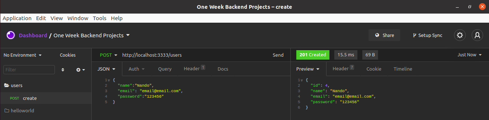
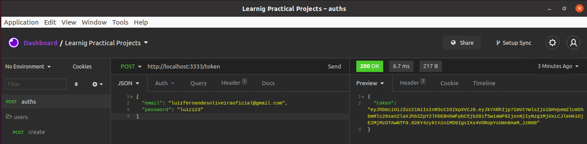
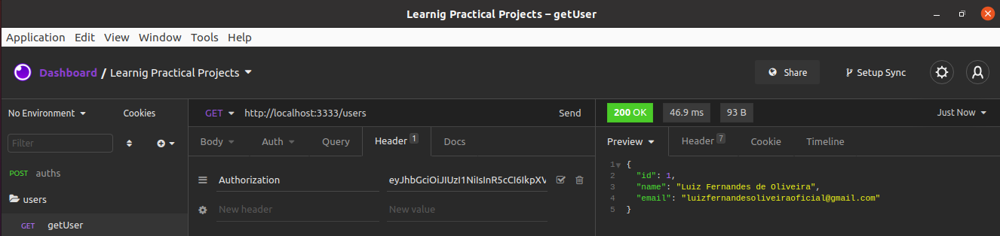
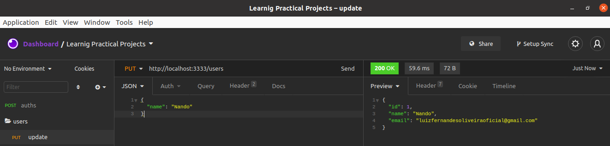
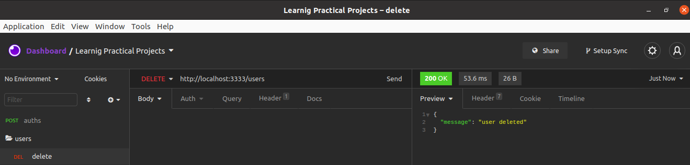

# #2 Authentication with JWT


### Problemática

criar um API que rode na porta 3333 que tenha um C.R.U.D. de Usuário e que para acessar os R.U.D. o usuário deve ter um token fornecido por uma autenticação feita com o JWT.

**Recursos**
- `HTTP/1.1 POST /users`



- `HTTP/1.1 POST /token`



- `HTTP/1.1 GET /users`



- `HTTP/1.1 PUT /users`



- `HTTP/1.1 DELETE /users`




### Starting

- **Instalando dependências**

  Para instalar as dependências basta rodar o seguinte comando:
  ```shellscript
  ./mvnw package
  ```

- **Inicializando Aplicação**

  Para inicializar a aplicação basta rodar o seguinte comando:
  ```shellscript
  ./mvnw spring-boot:run
  ```


- **Testando aplicação**

  Para inicializar os tests basta rodar o seguinte comando no terminal:
  ```shellscript
  ./mvnw test
  ```
